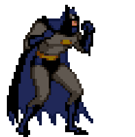

  

 
 

  

 

## About me
- 🎓 Studying Computer Science at [CESAR School](https://www.cesar.school/)
- 💻 Focused on **Back-end** development
- 🧠 Strong background in programming logic and problem-solving
- 🗣️ Fluent in English

## How to reach me 👤

## My skills

- **Programming Languages / Frameworks**

- **Development tools**

## My stats

  
  

  

 

